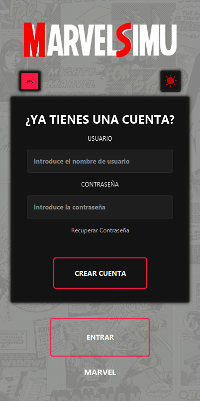
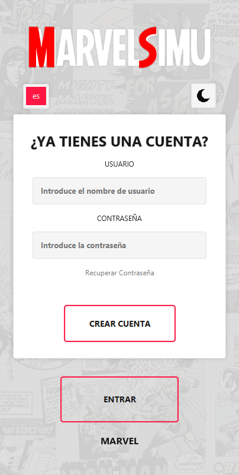

# Simulador de Combates Marvel 🦸‍♂️

   

## Descripción General
Una aplicación JavaFX que te permite simular batallas épicas entre tus personajes favoritos de Marvel. Elige tus luchadores, configura las condiciones de batalla y observa cómo el simulador determina el ganador basándose en sus habilidades y características.

## 🎮 Características Actuales

- **Autenticación de Usuario**
  - Crea tu cuenta personal
  - Sistema de inicio de sesión seguro
  - Opción de recuperación de contraseña

- **Interfaz Moderna**
  - Diseño limpio y adaptable
  - Soporte para tema claro/oscuro
  - Soporte multiidioma (Español, Inglés, Francés)

## 📸 Capturas de Pantalla

  <table>
    <tr>
      <td align="center">
        
         
        <i>Modo Oscuro</i>
      </td>
      <td align="center">
        
         
        <i>Modo Claro</i>
      </td>
    </tr>
  </table>

## 🚀 Próximamente

- **Selección de Personajes**
  - Amplio catálogo de héroes y villanos de Marvel
  - Estadísticas y habilidades detalladas
  - Herramientas de comparación de personajes

- **Sistema de Combate**
  - Diferentes modos de batalla
  - Cálculos dinámicos de combate
  - Habilidades especiales e interacciones de poder

- **Historial de Batallas**
  - Seguimiento de tu historial de combates
  - Estadísticas detalladas de batallas
  - Guardado de combates favoritos

## 🛠️ Requisitos Técnicos

- Java 17 o superior
- JavaFX 21
- Maven
- SQLite

## 🌐 Idiomas Disponibles

- 🇪🇸 Español
- 🇺🇸 Inglés
- 🇫🇷 Francés

## 🤝 Contribuir

Este proyecto está actualmente en desarrollo activo. No dudes en volver para ver las actualizaciones o contribuir a su desarrollo.

## 📝 Licencia

Este proyecto está licenciado bajo la Licencia MIT - consulta el archivo [LICENSE](LICENSE) para más detalles.

## ⚡ Inicio Rápido

1. Clona el repositorio
2. Ejecuta `mvn clean install`
3. Inicia con `mvn javafx:run`

---

  <i>Construyendo la experiencia definitiva de combate Marvel, una característica a la vez.</i>

