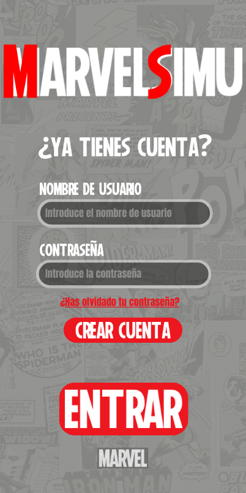
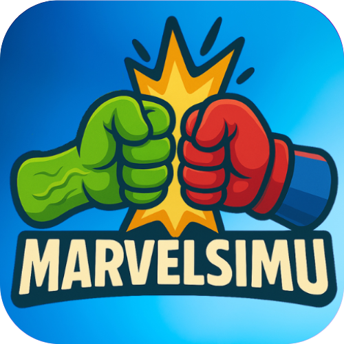

# 🦸‍♂️ MarvelSimu — Simulador de Combates Marvel  
*¡Elige, combate y domina!*


---

## 🧩 Descripción del Propósito

**MarvelSimu** es una aplicación interactiva construida con Java y JavaFX que permite a los usuarios experimentar combates estratégicos entre héroes y villanos del universo Marvel en escenarios icónicos. No es solo una simulación visual: se trata de un sistema con lógica de combate avanzada, animaciones dinámicas, soporte multilenguaje, gestión de usuarios y un enfoque modular que facilita la extensión del proyecto.

Está pensada tanto para fans del universo Marvel como para estudiantes que deseen aprender desarrollo de software moderno, estructuras de datos, bases de datos, interfaces gráficas y lógica orientada a eventos a través de un entorno divertido e inmersivo.

---

## ✨ Características Principales

- 🧠 **Selección de personajes** con estadísticas y habilidades activas/pasivas únicas.
- 🦾 **IA enemiga estratégica**, que toma decisiones basadas en lógica programada.
- 🌍 **Escenarios únicos y temáticos** como Wakanda, Kamar-Taj, Titán o Tenerife.
- ⚔️ **Sistema de combate por turnos** con ataques cuerpo a cuerpo, a distancia y habilidades especiales.
- 🎭 **Animaciones de combate** personalizadas para cada tipo de acción.
- 🧑‍💼 **Gestión de usuarios** con login, registro, recuperación y edición de perfil.
- 🌓 **Modo claro y oscuro**, activable desde la interfaz.
- 🌐 **Soporte multilenguaje**: español, inglés y francés.
- 🧪 **Test unitarios** para modelos, servicios y utilidades.
- 🖼️ **Diseño visual adaptado**, con CSS personalizado y pantallas dinámicas.

---

## 🧱 Arquitectura del Proyecto

- **Frontend**: JavaFX + FXML + CSS  
- **Backend**: Java (POO), dividido por lógica de combate, selección y servicios  
- **Persistencia**: SQLite  
- **Animaciones**: Sistema modular para efectos visuales y acciones  
- **Internacionalización**: `.properties` por idioma  
- **Testing**: JUnit en servicios y lógica de modelo  

---

## 🧪 Tecnologías Usadas

| Tecnología    | Descripción              |
|---------------|--------------------------|
| ☕ Java 17     | Lenguaje principal       |
| 🎨 JavaFX 21  | Interfaz gráfica         |
| 🗃️ SQLite     | Base de datos local      |
| ⚙️ Maven      | Gestión de dependencias  |
| 🧪 JUnit       | Pruebas automatizadas    |
| 🎨 CSS        | Estilos personalizados   |

---

## 🕹️ Flujo de Uso

1. **Pantalla de inicio**  
   Acceso a login, registro o recuperación de contraseña.

2. **Gestión de usuario**  
   Interfaz para editar perfil, nombre, contraseña e imagen.

3. **Selección de personajes y escenario**  
   - Creación de equipos.
   - Visualización de estadísticas y habilidades.
   - Selección manual o aleatoria de personajes.
   - Elección del escenario de combate.

4. **Pantalla de combate**  
   - Sistema por turnos: elige entre ataques, habilidades o cambiar estrategia.
   - Barra de mensajes con texto narrativo.
   - Animaciones visuales en cada acción.
   - Sistema de turnos inteligentes con IA.

5. **Resultado y fin del combate**  
   Mensaje final, resultado, efectos visuales y posibilidad de volver a jugar.

---

## 🌍 Internacionalización

La aplicación cuenta con un sistema de traducción automática gestionado por archivos `.properties`, con los siguientes idiomas disponibles:

- Español (`idioma-es.properties`)
- Inglés (`idioma-en.properties`)
- Francés (`idioma-fr.properties`)

---

## 🎨 Diseño Visual

<div align="center">
  <table>
    <tr>
      <td align="center">
        
        <br/>
        <i>Wireframe inicial</i>
      </td>
      <td align="center">
        
        <br/>
        <i>Modo oscuro</i>
      </td>
      <td align="center">
        
        <br/>
        <i>Modo claro</i>
      </td>
    </tr>
  </table>
</div>

> **Diferencias clave**: navegación simplificada, experiencia visual refinada, soporte dinámico de temas y estructura intuitiva.

---

Perfecto, tu idea es clara y muy efectiva: crear un “botón visual” con el logo para que el usuario sepa que debe hacer clic ahí para ver el video. Aquí tienes la sección mejorada y profesionalmente presentada para insertar directamente en tu `README.md`:

---

Sí, claro. Para ajustar el tamaño del logo de forma precisa, debes usar HTML en lugar de Markdown puro (porque Markdown no permite cambiar el tamaño de la imagen directamente).

Aquí tienes la versión final con el logo redimensionado (por ejemplo a 200 píxeles de ancho), manteniendo el estilo profesional:

---

### 📽️ Demostración Interactiva

<div align="center">

🔴 **Haz clic en el icono para ver el video demo**  
👇  
<a href="https://www.youtube.com/watch?v=B8pD74ChRik">
  
</a>

</div>

> 🎬 En este video se muestra el flujo completo de **selección de personajes** y el **combate por turnos**, incluyendo animaciones, estadísticas, lógica de IA enemiga y efectos visuales personalizados en los escenarios.

---

## ⚙️ Instrucciones de Instalación

1. Clona este repositorio:
   ```bash
   git clone https://github.com/tu-usuario/simulador-combates-marvel.git
   cd simulador-combates-marvel
   ```

2. Instala las dependencias y compila:
   ```bash
   mvn clean install
   ```

3. Ejecuta la aplicación:
   ```bash
   mvn javafx:run
   ```

---

## 🛤️ Roadmap (Mejoras Futuras)

- Modo campaña narrativa con historia.
- Editor de combates personalizados.
- Simulaciones masivas automáticas (ej. 100 vs 100).
- Modo espectador.
- Mayor variedad de habilidades por personaje.
- Sonido y música de combate.
- Exportación de estadísticas post-combate.

---

## 📜 Licencia

Este proyecto está bajo la **Licencia MIT**.  
Consulta el archivo [LICENSE](LICENSE) para más información.

---
