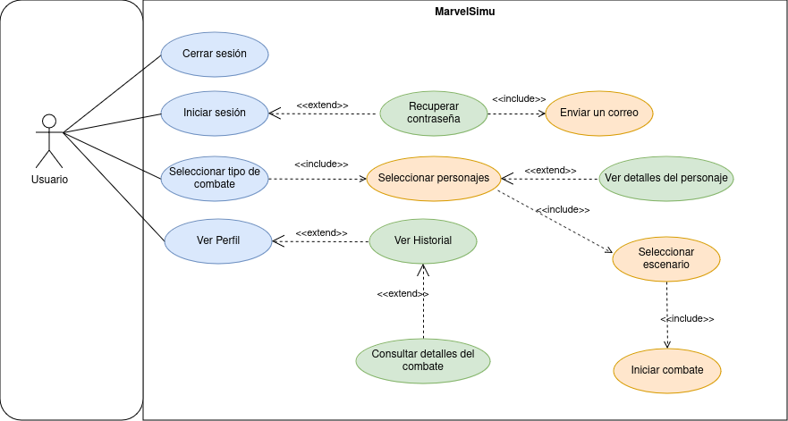

# Diagrama de Casos de Uso de MarvelSimu

## Especificaicón de Casos de uso de las reservas

## Actores
|  Actor | Usuario  |
|---|---|
| Descripción  | Usuario  |
| Características  |  |
| Relaciones | Cerrar sesión, iniciar sesión, seleccionar tipo de combate, ver perfil |
| Referencias |  |   
|  Notas |   |
| Autor  | Álvaro García López |
|Fecha | 20/03/2025 |

## Casos de uso

|  Caso de Uso	CU.1 | Cerrar sesión  |
  |---|---|
  | Fuentes  | Este documento  |
  | Actor  |  Usuario |
  | Descripción | Cerrar la sesión del usuario  |
  | Flujo básico | Ir al perfil, cerrar sesion |
  | Pre-condiciones | Nada |  
  | Post-condiciones  |  |  
  |  Requerimientos | No hay |
  |  Notas |  No hay |
  | Autor  | Alvaro Garcia Lopez |
  | Fecha | 20/03/2025 |

  |  Caso de Uso	CU.2 | Iniciar Sesión  |
  |---|---|
  | Fuentes  | Este documento  |
  | Actor  |  Usuario |
  | Descripción | Inicar sesión del usuario |
  | Flujo básico | No hay |
  | Pre-condiciones | Nada |  
  | Post-condiciones  | Ver disponibilidad  |  
  |  Requerimientos | Crear cuenta |
  |  Notas |  No hay |
  | Autor  | Alvaro Garcia Lopez |
  | Fecha | 20/03/2025 |

  |  Caso de Uso	CU.3 | Seleccionar tipo de combate  |
  |---|---|
  | Fuentes  | Este documento  |
  | Actor  |  Usuario |
  | Descripción | Elegir entre las distintas opciones de combates  |
  | Flujo básico | No hay |
  | Pre-condiciones | Ver disponibilidad  |  
  | Post-condiciones  | Seleccionar personajes, seleccionar escenario, iniciar combate  |  
  |  Requerimientos | Ninguno |
  |  Notas |  No hay |
  | Autor  | Alvaro Garcia Lopez |
  | Fecha | 20/03/2025 |

  |  Caso de Uso	CU.4 | Ver perfil |
  |---|---|
  | Fuentes  | Este documento  |
  | Actor  |  Usuario |
  | Descripción | Ver el perfil del usuario |
  | Flujo básico | Ninguno |
  | Pre-condiciones | Iniciar sesión  |  
  | Post-condiciones  | Nada  |  
  |  Requerimientos | Tener cuenta |
  |  Notas |  No hay |
  | Autor  | Alvaro Garcia Lopez |
  | Fecha | 20/03/2025 |

  ## Actores
  - **Usuario**: 
    - Persona que utiliza la aplicación para buscar simular combates y ver su historial.

  ## Operaciones que pueden realizar
  **Usuario**: Iniciar sesión, cerrar sesión, iniciar combate, ver perfil.
